# Laboratorio 1 (Parte 1): Implementación del Microservicio **Users** RESTFUL API
## Inovación y Emprendimiento con Tecnologías de Información
#### Camilo Andrés Pichimata Cárdenas
##### Agosto del 2022

## Objetivos
- Explicar lo que se debe hacer para alcanzar el nivel 2 en una API RESTFUL en el modelo de madurez de Richardson. 
- Implementar un microservicio API RESTFUL para usuarios (Users) de nivel 2.
- Implementar un microservicio API RESTFUL de tareas (Tasks) de nivel 2.
- Inyección de dependencias de usuario para crear una arquitectura desacoplada. 

## Temas Principales 
- Microservicios. 
- RESTFUL API. 
- Modelo de Madurez de Richardson. 
- Inyección de Dependencias.

## Ejecución
Para poder ejecutar la aplicación desde la línea de comandos se debe tener en cuenta que en el archivo `build.gradle` se debe incluir el plugin *application* y se debe definir la clase principal de la aplicación al final del archivo declarando la etiqueta *mainClassName*.

Teniendo en cuenta lo anterior, se procede a compilar la aplicación, para esto desde la carpeta raíz de esta se ejecuta el comando `gradle build` como se puede ver a continuación:
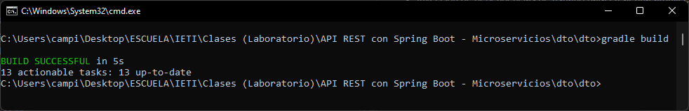

Después de compilada la ejecución se corre la aplicación ejecutando el comando `gradle run`, esto se puede ver a continuación:
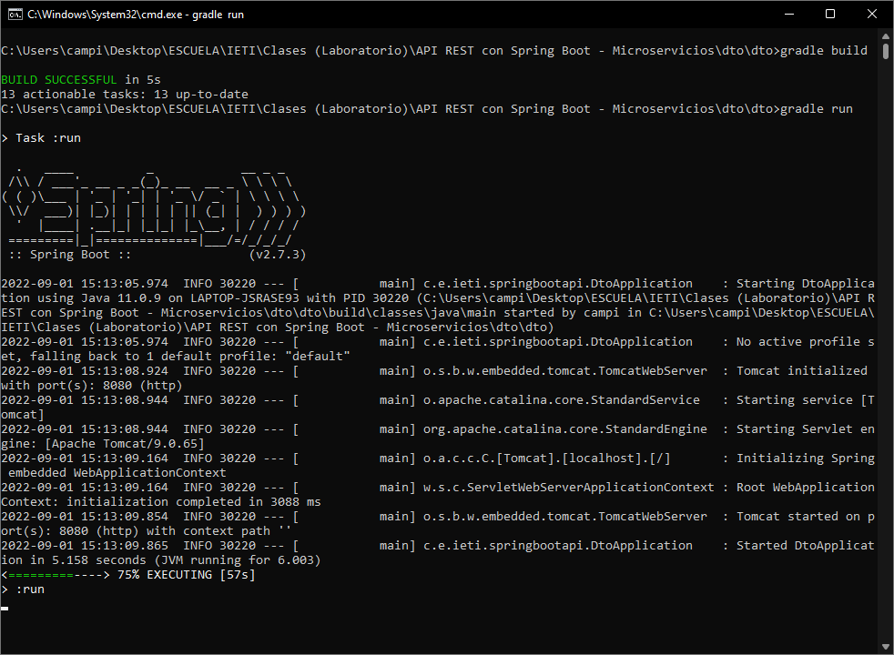

## Pruebas
Después de realizadas las implementaciones correspondientes se realizan las prubas de los endoints del API usando la aplicación [Insomnia](https://insomnia.rest/download).

Las pruebas realizadas se presentan a continuación:
### - Create
Se crea un nuevo usuario realizando una petición ***POST*** a la dirección `http://localhost:8080/`; Para esto se tiene en cuenta la siguiente información:
```json
{"id": "1", "name": "Juan", "email": "juan@gmail.com", "lastName": "Pérez", "createdAt": "2022-08-29T04:39:55.688+00:00"}
```
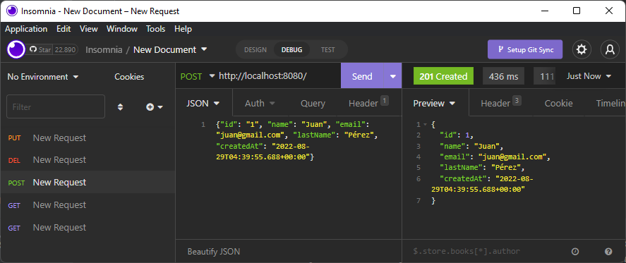

Si se intenta crear un nuevo usuario con un *ID* igual al de un usuario ya almacenado se presenta un conflicto y se responde con el código de error **409 (Conflict)**:
```json
{"id": "1", "name": "Pablo", "email": "pablo@gmail.com", "lastName": "López", "createdAt": "2022-08-29T04:39:55.688+00:00"}
```
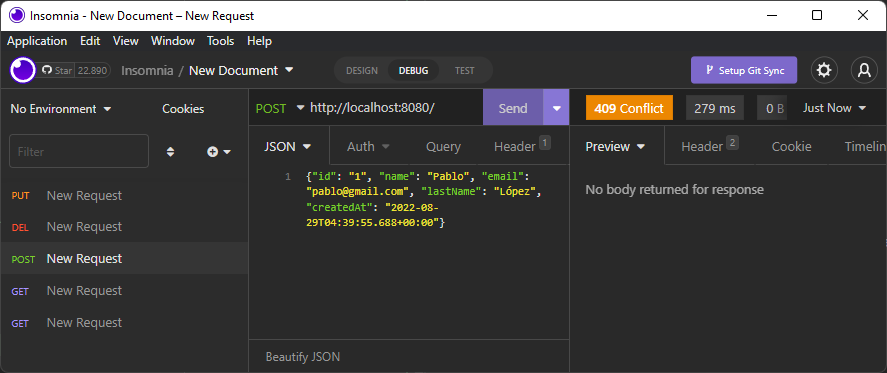

Como se puede observar, el *ID* especificado es el mismo al de la primera inserción, por lo que la acción no se permite, cambiando el *ID* a 2 ya es posible realizar la creación del usuario:
```json
{"id": "2", "name": "Pablo", "email": "pablo@gmail.com", "lastName": "López", "createdAt": "2022-08-29T04:39:55.688+00:00"}
```
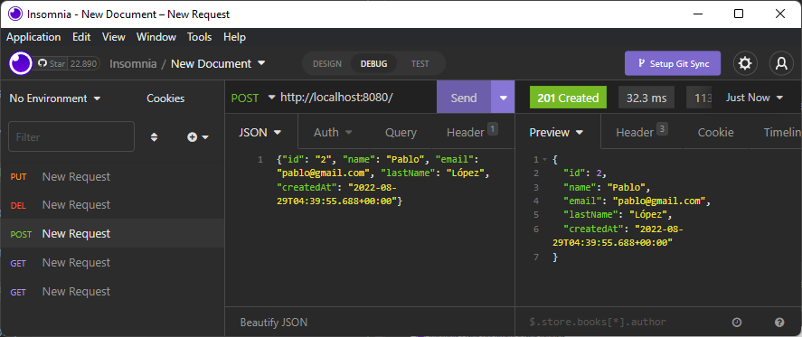

### - Get all
Para obtener el listado de todos los Usuarios registrados se realiza una petición ***GET*** a la dirección `http://localhost:8080/` como se puede observar a continuación:
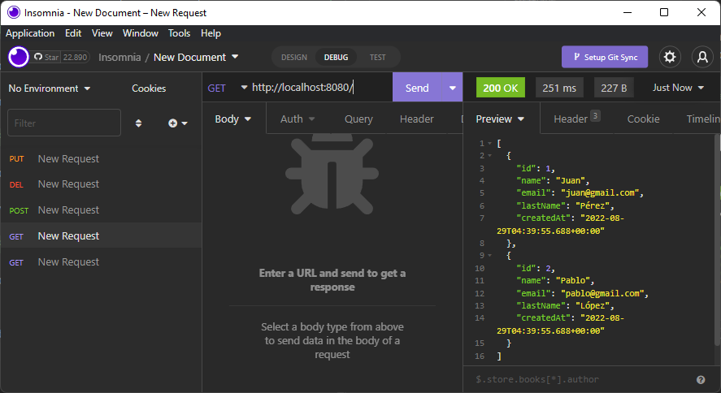
En la imagen se pueden observar los datos de los dos usuarios registrados anteriormente.

### - Find By Id
Para obtener la información de un usuario teniendo en cuenta su *ID*, se realiza una petición ***GET*** de acuerdo con el siguiente formato `http://localhost:8080/{ID}`, donde se reemplaza `{ID}` por el identificador del usuario a consultar, a continuación se presenta la consulta para el usuario que tiene ***ID = 2***, allí se puede observar la información obtenida al realizar la consulta:
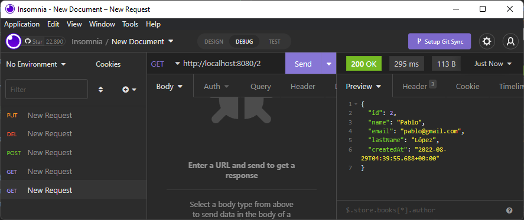
En caso de que se intente realizar una petición con un *ID* no registrado se responde con el código de error **404 (Not Found)** como se puede observar a continuación:
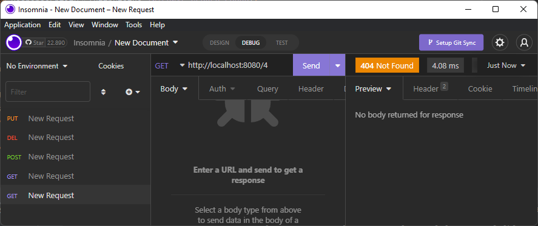

### - Update
Para la actualización de la información de un usuario se realiza una petición ***PUT*** teniendo en cuenta el siguiente formato `http://localhost:8080/{ID}`, donde se reemplaza `{ID}` por el identificador del usuario a modificar, en este caso cambiaremos el *email* del usuario con ***ID = 2***:
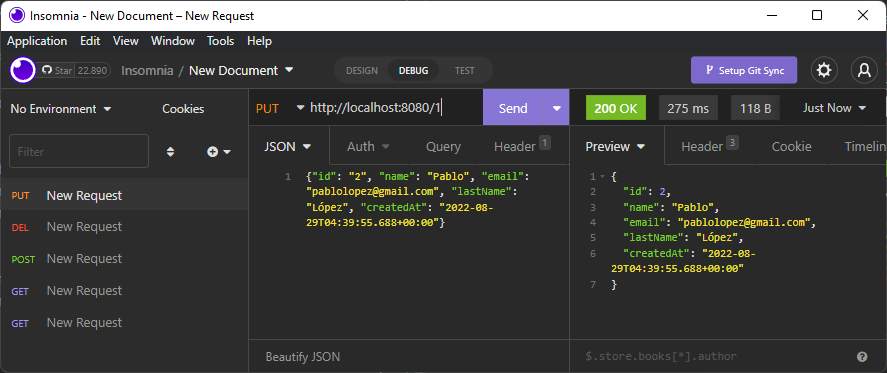

### - Delete
Para realizar la eliminación de la información de un usuario registrado se realiza una petición ***DEL*** teniendo en cuenta el siguiente formato `http://localhost:8080/{ID}` reemplazando `{ID}` por el identificador del usuario a eliminar como se mencionó anteriormente, en este caso se eliminará el usuario con ***ID = 1***:
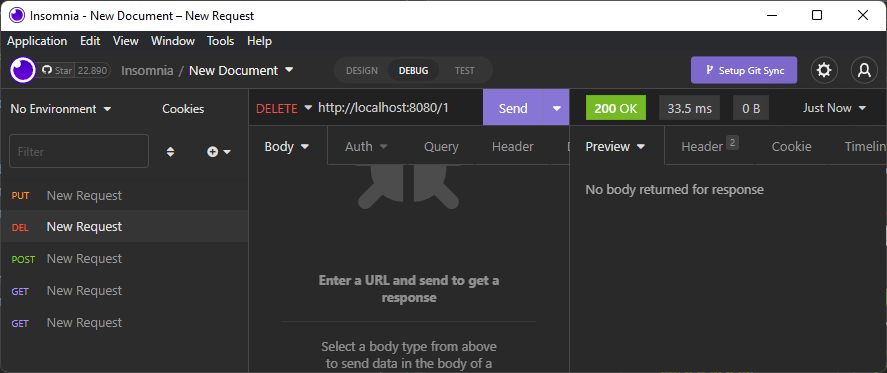
Al obtener nuevamente el listado de los usuarios registrados se puede observar que la información del usuario que se eliminó ya no se encuentra:
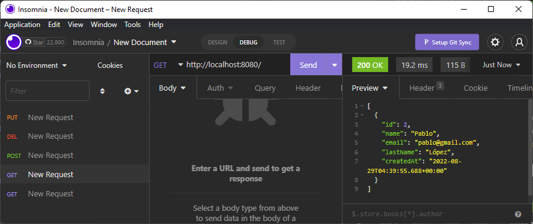
